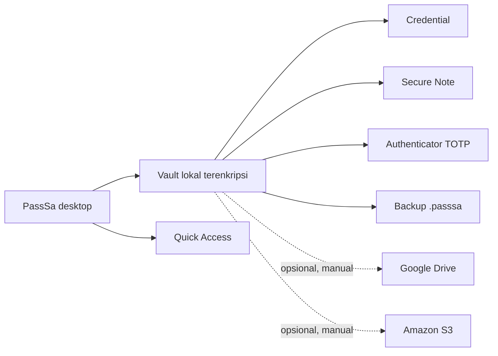

<div align="center">


# PassSa

### Password manager local-first untuk desktop

**Simpan rahasia di perangkat Anda. Sinkronkan hanya jika diperlukan.**

Vault lokal terenkripsi untuk credential, catatan aman, dan kode authenticator—dengan sinkronisasi opsional ke Google Drive atau Amazon S3.

[](#status-rilis)
[](#build-desktop)
[](#teknologi)
[](#keamanan-dan-privasi)

[Fitur](#fitur) · [Keamanan](#keamanan-dan-privasi) · [Mulai](#mulai-mengembangkan) · [Dokumentasi](#dokumentasi) · [Rilis GitHub](https://github.com/okkinurf/passsa/releases)

</div>

---

## Tentang PassSa

PassSa adalah aplikasi password manager desktop yang dirancang dengan pendekatan **local-first**. Vault bekerja tanpa akun cloud: data disimpan secara lokal dan dienkripsi sebelum ditulis ke disk. Google Drive dan S3 adalah pilihan sinkronisasi, bukan syarat untuk memakai aplikasi.

Versi desktop yang sedang disiapkan menggunakan **Tauri v2**. Shell native Tauri menangani jendela, penyimpanan kunci OS, clipboard, shortcut, dan dialog; service aplikasi saat ini berjalan di Node.js sidecar melalui perantara IPC yang dibatasi. Jadi, migrasi desktop ke Tauri sudah berjalan, sementara migrasi backend ke Rust belum dilakukan.

> [!WARNING]
> PassSa masih dalam pengembangan dan belum menjalani audit keamanan independen. Uji dengan data non-kritis dan simpan backup terenkripsi sebelum mengandalkannya untuk credential penting.

## Fitur

| Area | Yang tersedia |
| --- | --- |
| **Vault** | Credential login, Secure Note, custom fields, pencarian, kategori, grup, dan tag. |
| **Authenticator** | Simpan seed TOTP terenkripsi, lihat kode yang terus diperbarui, dan salin kode sekali klik. |
| **Pengelolaan** | Favorit, sampah dan pemulihan, riwayat password, statistik penggunaan, serta bulk actions. |
| **Akses cepat** | Jendela Quick Access dengan shortcut `Alt + Shift + P`, pencarian, item pin, dan aksi salin. |
| **Keamanan akun** | Password, password + 2FA TOTP, atau login langsung khusus perangkat—diatur dari Pengaturan. |
| **Tema** | Mode terang/gelap/sistem, sepuluh palet aksen, dan pengaturan opacity jendela utama. |
| **Sinkronisasi** | Snapshot vault terenkripsi melalui Google Drive atau Amazon S3/S3-compatible. Sinkronisasi dilakukan manual. |
| **Backup & transfer** | Backup `.passsa` terenkripsi dengan password terpisah, serta import/export CSV dengan peringatan plaintext. |
| **Update** | Pemeriksaan versi GitHub otomatis berkala dan pemeriksaan manual dari menu Tentang. Update dibuka melalui halaman rilis; pemasangan tidak berjalan diam-diam. |

### Cara kerjanya



## Keamanan dan privasi

| Bagian | Perilaku |
| --- | --- |
| Enkripsi vault | AES-256-GCM dengan kunci yang diturunkan menggunakan `scrypt` dan salt acak. |
| Password akun | Di-hash menggunakan `scrypt`; password asli tidak disimpan sebagai password akun. |
| Sesi | Kunci vault aktif berada di memori selama sesi terbuka. Kunci lokal/token provider dilindungi penyimpanan aman perangkat. |
| Penyimpanan native | Tauri memakai OS credential keyring; tidak ada fallback ke file plaintext jika penyimpanan aman tidak tersedia. Linux memerlukan Secret Service yang aktif. |
| Clipboard | Aksi salin ditangani melalui batas native dan clipboard dibersihkan otomatis setelah 30 detik. |
| Sinkronisasi | Google Drive/S3 menerima snapshot/envelope terenkripsi, bukan vault plaintext. Metadata objek tertentu tetap dapat terlihat oleh pemilik provider/bucket. |
| Password vault & cloud | Password vault lokal berbeda dari akun Google dan kredensial S3. Menghubungkan Google tidak menjadikan Google password vault. |
| Profil | Tauri dan Electron lama memakai lokasi data/keyring terpisah. Data tidak dimigrasikan atau dihapus otomatis. |

**Penting:** opsi login langsung hanya melindungi kenyamanan, bukan meminta autentikasi setiap kali aplikasi dibuka. Gunakan hanya pada profil perangkat pribadi yang tidak dibagikan. Pengaturan 2FA dan login perangkat tersimpan lokal, bukan bagian dari sinkronisasi vault.

> [!CAUTION]
> CSV berisi data plaintext. Simpan di lokasi aman dan hapus file ekspor setelah selesai. Backup `.passsa` terenkripsi lebih sesuai untuk pemindahan vault.

### Batasan yang perlu diketahui

- Build Tauri belum mendukung Windows Hello atau minimize-to-tray.
- Browser autofill/Native Messaging dan Windows Hello tersedia pada runtime Electron kompatibilitas lama, belum pada Tauri.
- Google Drive membutuhkan OAuth Desktop Client ID milik konfigurasi aplikasi. Jangan menyimpan `client_secret` atau token pengguna di repository.
- Build macOS CI belum ditandatangani/notarized. Installer Windows dengan self-signed tetap dapat menampilkan peringatan Windows; self-signed bukan kepercayaan publisher publik.
- Build Tauri memakai profil baru. Untuk memindahkan data, gunakan export/import backup `.passsa`; tidak ada migrasi profil Electron otomatis.

## Status rilis

Source branch ini menyiapkan PassSa **v0.2.0** berbasis Tauri v2. Nomor versi source belum berarti bahwa versi tersebut sudah menjadi GitHub Release. Periksa halaman [GitHub Releases](https://github.com/okkinurf/passsa/releases) untuk versi yang benar-benar dipublikasikan. Workflow build desktop saat ini mengunggah artifact CI selama 14 hari dan **tidak** membuat release secara otomatis.

## Mulai mengembangkan

### Prasyarat

- Node.js 22 dan npm.
- Rust stable serta toolchain native Tauri untuk OS Anda.
- **Windows:** WebView2 Runtime dan toolchain MSVC.
- **macOS:** Xcode Command Line Tools.
- **Linux:** GTK3, WebKitGTK 4.1, AppIndicator, libsecret, dan sesi desktop Secret Service.

### Jalankan aplikasi Tauri terbaru

```bash
git clone https://github.com/okkinurf/passsa.git
cd passsa
npm ci
npm run tauri:dev
```

Pada build debug Tauri tersedia tombol **Lewati login developer**. Tombol itu hanya aktif saat development dan memakai profil sementara terpisah; fixture/dummy vault tidak dimasukkan ke paket Tauri. Build release tetap meminta login.

Untuk memeriksa toolchain dan menjalankan semua pemeriksaan sebelum build:

```bash
npm run qa:full
npm run tauri:build
```

Hasil build berada di `src-tauri/target/release/bundle/`:

| OS | Paket |
| --- | --- |
| Windows | Installer NSIS `.exe` |
| Linux | AppImage dan `.deb` |
| macOS | `.dmg` |

Linux perlu Secret Service aktif saat aplikasi berjalan agar kunci dapat disimpan dengan aman. Build lokal hanya menghasilkan paket untuk platform toolchain host. Build semua OS dijalankan oleh workflow GitHub Actions pada runner masing-masing.

### Perintah QA

| Perintah | Cakupan |
| --- | --- |
| `npm test` | Unit dan integration test. |
| `npm run test:e2e` | Smoke test UI pada renderer Electron kompatibilitas. |
| `npm run perf:smoke` | Pemeriksaan performa dasar pada runtime Electron. |
| `npm run qa:tauri` | Validasi konfigurasi, toolchain, staging/runtime, audit fixture/credential, dan smoke test sidecar Tauri. |
| `npm run qa:full` | QA aplikasi, E2E, performa, validasi Tauri, dan pemeriksaan sintaks. |

Workflow [Tauri desktop builds](.github/workflows/tauri-desktop-build.yml) membangun Windows, macOS, Linux; artifact disimpan 14 hari. Workflow ini tidak menerbitkan GitHub Release. Proses build memeriksa fixture development dan file credential pada runtime Tauri sebelum packaging.

### Profil pengembangan Electron lama

Runtime Electron dipertahankan sementara untuk kompatibilitas dan beberapa test. `npm start` serta `npm run dev:skip-login` menjalankan **Electron, bukan aplikasi Tauri terbaru**. Jalur `dev:skip-login` dapat memuat dataset dummy untuk QA; jangan masukkan profil atau dummy tersebut ke rilis. Gunakan `npm run tauri:dev` untuk mengembangkan versi desktop terkini.

## Teknologi

| Teknologi | Peran |
| --- | --- |
| Tauri v2 + Rust | Shell desktop, jendela native, clipboard, shortcut, keyring, dan dialog OS. |
| Node.js sidecar | Menjalankan service aplikasi yang sedang dipakai bersama runtime kompatibilitas. |
| JavaScript, HTML, CSS | UI dan logika aplikasi. |
| AES-256-GCM + `scrypt` | Enkripsi vault dan derivasi kunci. |
| Google OAuth 2.0 + PKCE | Otorisasi provider Google Desktop. |
| AWS SDK for JavaScript | Integrasi Amazon S3 dan endpoint S3-compatible. |
| TOTP | Kode authenticator dan opsi 2FA login. |

## Dokumentasi

| Dokumen | Isi |
| --- | --- |
| [Arsitektur](docs/ARCHITECTURE.md) | Struktur modul, alur perubahan, dan batas backend Tauri. |
| [Keamanan](docs/SECURITY_FEATURES.md) | Perilaku dan batas fitur keamanan. |
| [Tauri v2](docs/TAURI_V2_MIGRATION.md) | Build, profil terpisah, kompatibilitas, dan batas platform. |
| [Google OAuth & Drive](docs/GOOGLE_OAUTH_SETUP.md) | Konfigurasi OAuth dan sinkronisasi Drive. |
| [Amazon S3](docs/S3_SYNC_SETUP.md) | Bucket, endpoint S3-compatible, dan konfigurasi sinkronisasi. |
| [Browser Autofill](docs/AUTOFILL_SETUP.md) | Native Messaging dan setup extension untuk runtime yang mendukung. |
| [Rilis Windows lama](docs/WINDOWS_RELEASE.md) | Catatan pipeline Electron historis dan signing. |
| [Catatan arsitektur KeePassXC](docs/KEEPASSXC_ARCHITECTURE.md) | Referensi pemisahan modul. |
| [Third-party notices](THIRD_PARTY_NOTICES.md) | Informasi dependency pihak ketiga. |

## Data dan kompatibilitas

Tauri membuat profil data tersendiri bernama **PassSa Tauri**. Installasi Electron lama tetap utuh, tetapi data tidak otomatis muncul di Tauri. Sebelum memindahkan vault, pastikan Anda masih mengingat password backup dan memiliki salinan file `.passsa` yang dapat dipulihkan.

## Kontribusi

Sebelum mengirim perubahan, jalankan `npm run qa:full`, periksa `git diff --check`, dan pastikan tidak ada vault, token, file `.env`, client secret, atau kunci signing yang ikut. Baca juga [arsitektur](docs/ARCHITECTURE.md) dan [batas keamanan](docs/SECURITY_FEATURES.md).

## Lisensi

Repository ini belum menyertakan file `LICENSE`; hak penggunaan ulang kode belum diberikan sebagai lisensi open-source.

<div align="center">

---

**PassSa — local-first, terenkripsi, dan tetap dalam kendali Anda.**

[Lihat source](https://github.com/okkinurf/passsa) · [Cek rilis](https://github.com/okkinurf/passsa/releases)

</div>
