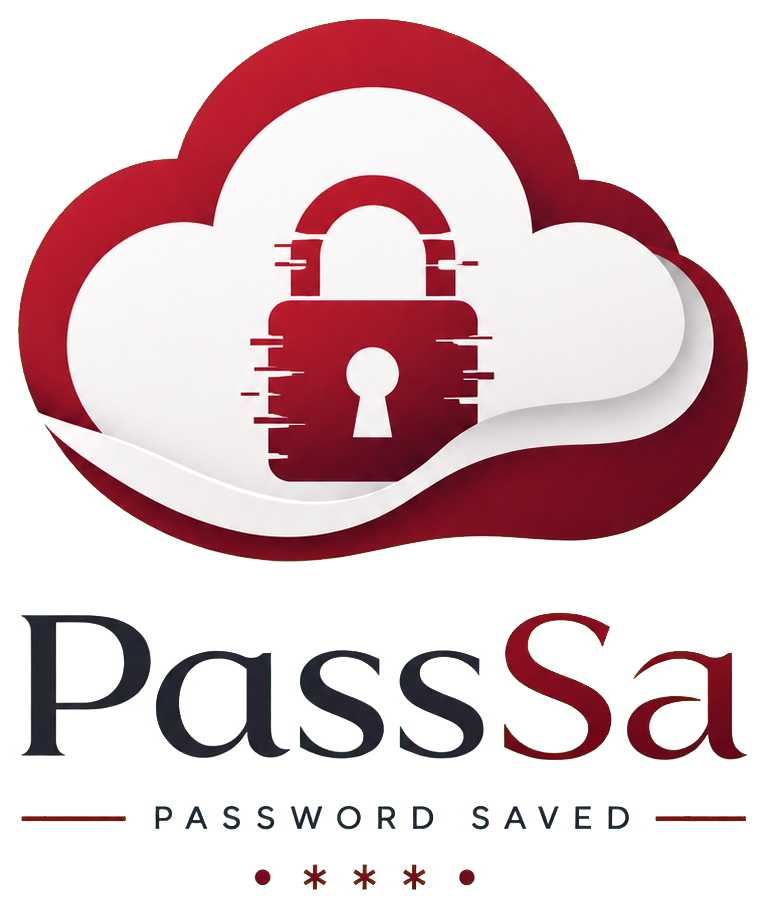
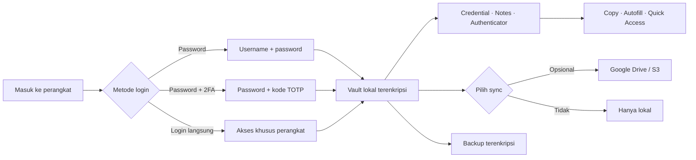
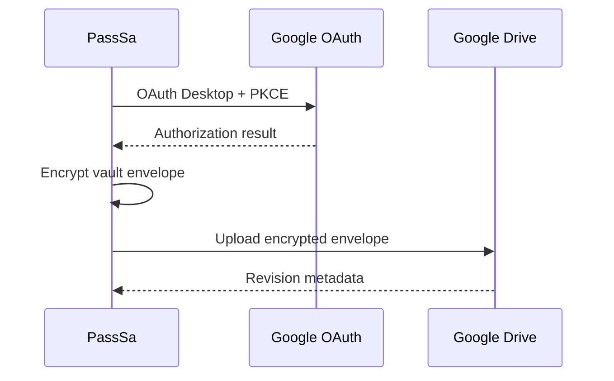
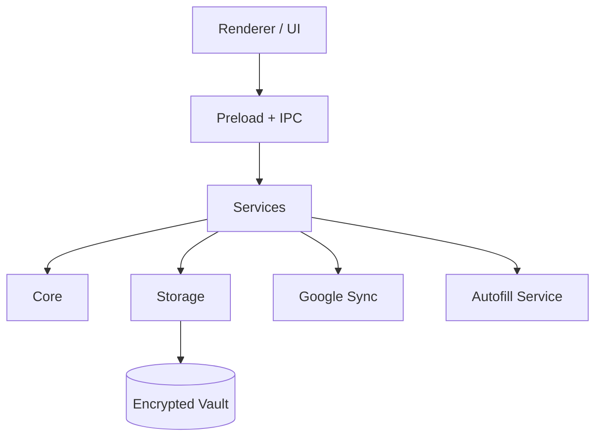
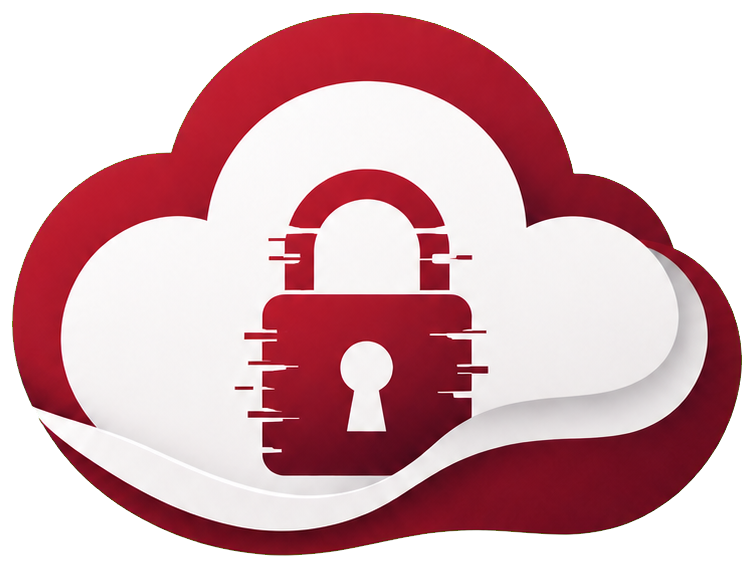

<div align="center">



# PassSa

### Password manager local-first untuk Windows

Simpan credential di perangkat Anda. Enkripsi vault dengan **AES-256-GCM**. Sinkronkan secara opsional lewat **Google Drive** atau **Amazon S3**.

[](#roadmap)
[](#menjalankan-passsa)
[](#tech-stack)
[](#model-keamanan)
[](#metode-login)
[](#sinkronisasi-cloud)

**Dalam pengembangan · v0.1.4** — runtime desktop saat ini Electron. Tauri v2 masih tahap persiapan migrasi.

[Fitur](#fitur-utama) · [Keamanan](#model-keamanan) · [Jalankan](#menjalankan-passsa) · [Roadmap](#roadmap) · [Dokumentasi](#dokumentasi)

</div>

---

## 📖 Tentang PassSa

**PassSa** adalah password manager desktop Windows dengan pendekatan **local-first**. Credential utama disimpan pada vault lokal terenkripsi dan tidak membutuhkan cloud agar dapat digunakan.

Google Drive dan Amazon S3 bersifat opsional dan hanya digunakan untuk sinkronisasi snapshot vault terenkripsi. Password vault, refresh token, dan secret lain tidak dirancang untuk disimpan sebagai plaintext.

PassSa juga menyediakan Authenticator TOTP, Windows Hello, browser autofill, Secure Note, custom fields, tags, groups, favorites, Trash, riwayat password, backup terenkripsi, serta import/export.

> [!WARNING]
> PassSa masih dalam tahap pengembangan. Lakukan pengujian dan review keamanan sebelum menggunakannya untuk credential produksi yang kritikal.

---

## 🖥️ Preview

Dirancang untuk vault lokal yang mudah dipakai: cari item, salin data dengan cepat, dan pilih sendiri apakah vault tetap hanya di perangkat atau disinkronkan.

<table>
  <tr>
    <td width="33%"><strong>🔐 Vault terenkripsi</strong><br />Data utama tetap lokal dan dienkripsi saat tersimpan.</td>
    <td width="33%"><strong>🧭 Akses cepat</strong><br />Authenticator TOTP dan Quick Access membantu alur sehari-hari.</td>
    <td width="33%"><strong>☁️ Sync pilihan Anda</strong><br />Google Drive atau S3, dengan snapshot vault terenkripsi.</td>
  </tr>
</table>

### Alur penggunaan



<a id="metode-login"></a>
### Pilih cara membuka vault

Metode login diatur setelah akun dibuat melalui **Pengaturan → Metode login**. Vault dapat dibuka dengan username/password, password ditambah kode Google Authenticator, atau login langsung pada perangkat tersebut. Login langsung mengurangi perlindungan lokal: siapa pun yang memakai sesi Windows Anda dapat membuka vault. Pengaturan 2FA tersimpan per perangkat dan tidak ikut tersinkron.

---

<a id="fitur-utama"></a>
## ✨ Fitur Utama

| Fitur | Status | Keterangan |
| --- | :---: | --- |
| Encrypted local vault | ✅ | AES-256-GCM |
| Password-based key derivation | ✅ | `scrypt` + random salt |
| Windows Hello | ✅ opsional | Unlock biometrik/PIN Windows; tersembunyi secara default dan diaktifkan dari Pengaturan |
| Google OAuth Desktop PKCE | ✅ opsional | Google dipakai untuk cloud sync; login lokal tetap menjadi jalur utama |
| Google Drive encrypted sync | ✅ opsional | Folder `PassSa` dibuat atau digunakan kembali, lalu envelope terenkripsi diunggah |
| Amazon S3 / S3-compatible sync | ✅ opsional | Sinkronisasi manual snapshot vault terenkripsi; termasuk endpoint seperti MinIO |
| Metode login pilihan | ✅ | Password, password + 2FA, atau login langsung khusus perangkat; diatur lewat Pengaturan |
| Login 2FA + recovery code | ✅ opsional | TOTP untuk autentikasi akun; konfigurasi kunci 2FA tetap lokal per perangkat |
| Authenticator vault | ✅ | Simpan akun TOTP dan salin kode sekali-klik |
| Browser autofill | ✅ opsional | Chromium Manifest V3 + Native Messaging; aktif hanya setelah setup eksplisit |
| Secure Note | ✅ | Catatan terenkripsi tanpa credential login |
| Custom Fields | ✅ | Text, Secret, URL, Email, Angka, Ya/Tidak |
| Tags & Groups | ✅ | Organisasi dan bulk operation |
| Favorites & Trash | ✅ | Restore dan permanent delete |
| Password history | ✅ | Hingga 10 perubahan terakhir |
| Usage statistics | ✅ | Sort berdasarkan frekuensi dan recent usage |
| Encrypted `.passsa` backup | ✅ | Password backup terpisah |
| CSV import/export | ✅ | Interoperabilitas dengan warning plaintext |
| Clipboard auto-clear | ✅ | Dibersihkan setelah 30 detik |
| Single-instance protection | ✅ | Satu instance aplikasi aktif |
| Atomic vault write | ✅ | Lock file, temp file unik, dan backup |

---

<a id="model-keamanan"></a>
## 🛡️ Model Keamanan

| Komponen | Implementasi |
| --- | --- |
| Vault lokal | AES-256-GCM |
| Derivasi kunci | `scrypt` + random salt |
| Session key | Hanya berada di memory selama sesi login |
| Password akun | Di-hash dengan `scrypt`; password asli tidak disimpan |
| Google OAuth | OAuth 2.0 Desktop dengan PKCE |
| Google refresh token | Electron `safeStorage` / Windows DPAPI |
| Google Drive sync | Hanya envelope terenkripsi + metadata revisi |
| S3 sync | Snapshot terenkripsi; access key dilindungi Windows `safeStorage` |
| 2FA login | TOTP dan recovery code tersimpan lokal; bukan bagian dari sinkronisasi vault |
| Windows Hello | Verifikasi biometrik + key wrapping melalui `safeStorage` |
| Clipboard | Dibersihkan otomatis setelah 30 detik |
| Renderer | Secret tidak dikirim pada response list credential |

Google hanya digunakan untuk memverifikasi identitas dan menyediakan media sinkronisasi. Password vault lokal tetap digunakan untuk menurunkan kunci enkripsi vault.

### Prinsip keamanan

```text
Password Vault
     │
     ▼
   scrypt
     │
     ▼
Vault Encryption Key
     │
     ├──► AES-256-GCM ──► Local Vault
     │
     ├──► Windows Hello / DPAPI wrapper
     │
     ├──► Encrypted Envelope ──► Google Drive
     └──► Encrypted Snapshot ──► Amazon S3
```

> [!CAUTION]
> Export CSV menghasilkan credential dalam bentuk plaintext. PassSa meminta konfirmasi eksplisit sebelum proses export/import CSV dilakukan.

Detail: [`docs/SECURITY_FEATURES.md`](docs/SECURITY_FEATURES.md).

---

## 🔐 Login dan Sinkronisasi Cloud

Login untuk membuka vault dipisahkan dari akun Google dan kredensial S3:

1. Buat akun lokal; setelah itu pilih metode login di **Pengaturan → Metode login**.
2. Jika perlu sinkronisasi, hubungkan Google Drive atau Amazon S3 dari menu Pengaturan.
3. Google menggunakan OAuth Desktop + PKCE. S3 dapat memakai AWS S3 maupun endpoint S3-compatible.
4. Sinkronisasi dilakukan manual. Data vault diunggah sebagai snapshot terenkripsi; perubahan bersamaan menghasilkan salinan konflik terenkripsi.

Penyedia cloud tidak menggantikan metode login lokal. Memutus koneksi hanya menghapus kredensial cloud dari perangkat dan tidak menghapus vault lokal maupun objek cloud. Untuk S3, metadata akun di dalam snapshot tetap dapat terlihat oleh pemegang akses bucket.

Panduan: [`docs/GOOGLE_OAUTH_SETUP.md`](docs/GOOGLE_OAUTH_SETUP.md) · [`docs/S3_SYNC_SETUP.md`](docs/S3_SYNC_SETUP.md).

<a id="sinkronisasi-cloud"></a>
### Provider yang didukung

| Provider | Cara kerja | Panduan |
| --- | --- | --- |
| Google Drive | OAuth Desktop + PKCE; menyimpan envelope vault terenkripsi | [`Google OAuth & Drive`](docs/GOOGLE_OAUTH_SETUP.md) |
| Amazon S3 / S3-compatible | Sinkronisasi manual ke bucket privat; mendukung endpoint seperti MinIO | [`Amazon S3`](docs/S3_SYNC_SETUP.md) |

---

<a id="tech-stack"></a>
## 🧰 Tech Stack

| Teknologi | Penggunaan |
| --- | --- |
| Electron 39 | Desktop application runtime |
| JavaScript | Core, services, storage, renderer, tooling |
| HTML/CSS | Desktop UI |
| Node.js | Runtime dan development tooling |
| AES-256-GCM | Enkripsi vault dan backup |
| `scrypt` | Password hashing dan key derivation |
| Windows DPAPI | Proteksi token/kunci melalui Electron `safeStorage` |
| Google OAuth 2.0 + PKCE | Login Google desktop |
| Google Drive API | Optional encrypted synchronization |
| AWS SDK for JavaScript | S3 and S3-compatible synchronization |
| Chromium Manifest V3 | Browser extension autofill |
| Native Messaging | Komunikasi extension ↔ PassSa |
| NSIS / electron-builder | Windows installer |
| Tauri v2 | Scaffold dan validasi migrasi; belum menjadi runtime produksi |

---

<a id="menjalankan-passsa"></a>
## 🚀 Menjalankan PassSa

### Prasyarat

- Windows sebagai platform utama.
- Node.js versi LTS.
- npm.
- Git.

### 1. Clone repository

```bash
git clone https://github.com/okkinurf/passsa.git
cd passsa
```

### 2. Install dependency

```bash
npm install
```

### 3. Jalankan aplikasi

```bash
npm start
```

### Profil development dengan data demo

Untuk mencoba aplikasi tanpa mengubah vault utama, jalankan profil development terpisah:

```bash
npm run dev:skip-login
```

Profil ini melewati layar login hanya untuk pengembangan dan berisi **200 item dummy bervariasi**—credential, Secure Note, dan Authenticator. Seluruh data bertanda demo dan tidak boleh dipakai sebagai kredensial sungguhan.

---

## 👤 Membuat User Testing

Akun testing dapat dibuat atau diperbarui menggunakan script bawaan.

### PowerShell

```powershell
$env:PASSA_TEST_USERNAME = "test@example.com"
$env:PASSA_TEST_PASSWORD = "password-testing"
npm run create-test-user
```

Password minimal 8 karakter. Email/username akan dinormalisasi menjadi huruf kecil.

### Seed 100 dummy item ke akun testing

```powershell
$env:PASSA_TEST_USERNAME = "test@example.com"
$env:PASSA_TEST_PASSWORD = "password-testing"
npm run seed-dummy-vault
```

Seed ini memerlukan akun testing yang sudah dibuat. Jangan gunakan `PASSA_RESET_VAULT=true` pada akun yang menyimpan data penting.

Untuk menghapus seluruh isi vault sebelum membuat dummy:

```powershell
$env:PASSA_RESET_VAULT = "true"
npm run seed-dummy-vault
```

> [!WARNING]
> `PASSA_RESET_VAULT=true` akan menghapus item asli dan Trash pada vault testing tersebut.

---

<a id="google-sync"></a>
## ☁️ Google OAuth & Google Drive Sync

PassSa menggunakan **OAuth 2.0 Desktop + PKCE**. Client secret tidak diperlukan dan tidak boleh ditanam di source code desktop.

### Konfigurasi cepat

1. Buat/select project di Google Cloud.
2. Enable **Google Drive API**.
3. Konfigurasikan OAuth consent screen.
4. Buat **OAuth Client ID** bertipe **Desktop app**.
5. Set Client ID sebelum menjalankan aplikasi.

```powershell
$env:PASSA_GOOGLE_CLIENT_ID = "1234567890-xxxxx.apps.googleusercontent.com"
npm start
```

Scope yang digunakan:

```text
https://www.googleapis.com/auth/drive.file
```

### Cara sync bekerja



Jika data lokal dan remote berubah bersamaan, file utama Drive dipertahankan dan versi lokal disimpan sebagai conflict copy terenkripsi.

Panduan lengkap: [`docs/GOOGLE_OAUTH_SETUP.md`](docs/GOOGLE_OAUTH_SETUP.md).

---

## 🌐 Browser Autofill

Extension Chromium tersedia pada:

```text
browser-extension/
```

Autofill menggunakan **Manifest V3 + Native Messaging**. Credential hanya diminta dari PassSa setelah pengguna memilih item secara eksplisit, dengan pencocokan host, protocol, dan port secara ketat.

```text
Browser
   │
   ▼
PassSa Extension
   │ Native Messaging
   ▼
PassSa Desktop
   │
   ▼
Encrypted Vault
```

Setup production membutuhkan Native Messaging Host dan Extension ID resmi.

Panduan: [`docs/AUTOFILL_SETUP.md`](docs/AUTOFILL_SETUP.md).

---

## 🧪 Testing & QA

| Command | Fungsi |
| --- | --- |
| `npm test` | Unit/integration test |
| `npm run test:e2e` | Smoke test UI Electron |
| `npm run qa` | Unit/integration + E2E |
| `npm run qa:tauri` | Validasi konfigurasi dan prerequisite Tauri |
| `npm run qa:full` | QA lengkap + Tauri validation + syntax audit |
| `npm run qa:google-network` | QA konektivitas Google |
| `npm run qa:installer` | QA installer Windows |

Sebelum packaging/release:

```bash
npm run qa:full
```

---

## 📦 Build Windows

### Package tanpa installer

```bash
npm run pack
```

### Installer unsigned untuk QA lokal

```bash
npm run dist:unsigned
```

### Installer production signed

```bash
npm run dist
```

Build production mewajibkan code-signing credential.

Detail: [`docs/WINDOWS_RELEASE.md`](docs/WINDOWS_RELEASE.md).

---

## 🏗️ Struktur Project

```text
passsa/
├── browser-extension/      # Chromium autofill extension
├── build/                  # Windows build assets
├── docs/                   # Dokumentasi teknis
├── scripts/                # QA, seed, packaging, native helper
├── src/
│   ├── assets/             # Logo & visual assets
│   ├── core/               # Domain rules & normalization
│   ├── main/               # Main-process helpers
│   ├── services/           # Auth, vault, sync, import/export, autofill
│   ├── storage/            # Atomic storage, encrypted token/key handling
│   └── renderer.js         # Main renderer UI
├── src-tauri/              # Persiapan shell Tauri v2
├── test/                   # Unit & integration tests
├── main.js                 # Electron composition root & IPC
├── preload.js              # Secure renderer API via contextBridge
└── package.json
```

### Architecture



Prinsip utama:

```text
UI → Service → Core / Storage
```

Logika domain dipisahkan dari Electron/DOM, sedangkan operasi mutasi vault diserialisasi untuk mencegah dua proses menimpa data satu sama lain.

Detail: [`docs/ARCHITECTURE.md`](docs/ARCHITECTURE.md).

---

<a id="roadmap"></a>
## 🗺️ Roadmap

### v0.1 — Core Password Manager

- [x] Local encrypted vault.
- [x] AES-256-GCM encryption.
- [x] `scrypt` password hashing dan key derivation.
- [x] Credential groups dan tags.
- [x] Favorites dan Trash.
- [x] Password history.
- [x] Secure Notes.
- [x] Custom Fields.
- [x] Encrypted `.passsa` backup.
- [x] CSV import/export.
- [x] Clipboard auto-clear.

### Desktop Integration

- [x] Windows Hello integration.
- [x] Google OAuth Desktop + PKCE.
- [x] Encrypted Google Drive sync.
- [x] Chromium Manifest V3 autofill extension.
- [x] Native Messaging integration.
- [x] Quick Access UI.
- [x] Electron installer pipeline.
- [ ] Production code signing configuration.
- [ ] Official browser-extension distribution workflow.

### QA & Hardening

- [x] Unit/integration tests.
- [x] Electron E2E smoke test.
- [x] Full QA command.
- [x] Installer QA tooling.
- [x] Atomic vault writes dan locking.
- [ ] Broader automated regression coverage.
- [ ] Independent security review / audit.

### Next Platform

- [x] Tauri v2 migration preparation.
- [x] Tauri configuration/prerequisite validation.
- [ ] Migrate vault backend ke native Rust implementation.
- [ ] Complete Tauri desktop runtime migration.
- [ ] Android application exploration/port.

> Roadmap dapat berubah mengikuti hasil QA, security review, dan kebutuhan project.

---

<a id="dokumentasi"></a>
## 📚 Dokumentasi

| Dokumen | Keterangan |
| --- | --- |
| [`ARCHITECTURE.md`](docs/ARCHITECTURE.md) | Arsitektur dan workflow perubahan |
| [`SECURITY_FEATURES.md`](docs/SECURITY_FEATURES.md) | Detail fitur keamanan |
| [`GOOGLE_OAUTH_SETUP.md`](docs/GOOGLE_OAUTH_SETUP.md) | Konfigurasi Google OAuth dan Drive |
| [`S3_SYNC_SETUP.md`](docs/S3_SYNC_SETUP.md) | Konfigurasi Amazon S3 dan endpoint S3-compatible |
| [`AUTOFILL_SETUP.md`](docs/AUTOFILL_SETUP.md) | Setup browser autofill |
| [`WINDOWS_RELEASE.md`](docs/WINDOWS_RELEASE.md) | Build dan release Windows |
| [`TAURI_V2_MIGRATION.md`](docs/TAURI_V2_MIGRATION.md) | Persiapan migrasi Tauri v2 / Android |
| [`KEEPASSXC_ARCHITECTURE.md`](docs/KEEPASSXC_ARCHITECTURE.md) | Catatan adaptasi arsitektur KeePassXC |
| [`THIRD_PARTY_NOTICES.md`](THIRD_PARTY_NOTICES.md) | Third-party notices |

---

## ⚠️ Batasan Saat Ini

- Google OAuth dan Google Drive nyata membutuhkan Desktop Client ID dari project Google Cloud pengguna.
- Installer production membutuhkan certificate Authenticode atau Azure Trusted Signing milik publisher.
- Autofill production membutuhkan registrasi Native Messaging Host dan Extension ID resmi.
- Windows Hello dan Browser Autofill tersedia sebagai fitur opsional; keduanya tersembunyi secara default sampai dikonfigurasi dari Pengaturan/setup terkait.
- Shell Tauri v2 masih merupakan persiapan migrasi; backend vault utama saat ini tetap pada implementasi Electron.

---

## 🤝 Development Workflow

Untuk perubahan fitur utama:

1. Definisikan aturan data dan validasi di `src/core/`.
2. Implementasikan use-case di `src/services/`.
3. Tambahkan unit/integration test.
4. Tambahkan IPC handler dan expose API minimal melalui preload.
5. Implementasikan UI di renderer.
6. Tambahkan jalur E2E bila diperlukan.
7. Jalankan `npm run qa:full` sebelum packaging/release.

### Checklist sebelum commit/release

```text
[ ] npm test
[ ] npm run test:e2e
[ ] npm run qa:full
[ ] git diff --check
[ ] cek perubahan schema
[ ] cek backup / rollback
[ ] cek code signing sebelum installer production
```

---

<a id="lisensi"></a>
## 📄 Lisensi

Lisensi open-source belum ditetapkan pada repository ini. Sampai file `LICENSE` ditambahkan, hak cipta tetap berada pada pemilik project dan penggunaan ulang kode perlu mendapat izin.

---

## 🙏 Acknowledgements

Struktur project mengadaptasi beberapa prinsip pemisahan **core / crypto / storage / service / GUI** dari KeePassXC.

Detail: [`docs/KEEPASSXC_ARCHITECTURE.md`](docs/KEEPASSXC_ARCHITECTURE.md).

Informasi dependency pihak ketiga tersedia pada [`THIRD_PARTY_NOTICES.md`](THIRD_PARTY_NOTICES.md).

---

<div align="center">



### PassSa

**Secure locally. Sync encrypted. Stay in control.**

Made for Windows · Local-first · Encrypted by design

</div>
